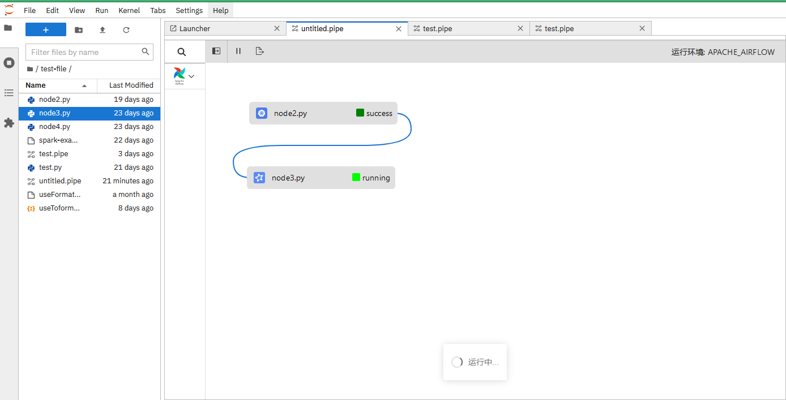

# redevelop-elyra

根据 `elyra` 插件的 `Pipeline Editor` 二次开发的数据湖前端 jupyterlab 插件，用于运行/提交 k8s 和 Spark 任务节点组成的工作流，并实时获取工作流的运行状态。

<div align="left">
    
</div>

# 相关文档

- [需求](%E5%B7%A5%E4%BD%9C%E6%B5%81%E5%88%9B%E5%BB%BA%E5%8F%8A%E8%BF%90%E8%A1%8C.docx)

- [操作手册](%E6%93%8D%E4%BD%9C%E6%89%8B%E5%86%8C.docx)

# 环境搭建

```shell
# 初始化虚拟环境（PS. jupyterlab 安装版本指定为 jupyterlab==x.x.x ，nodejs 和 git 如果机器上已经安装了则不用再次安装）
conda create -n jupyterlab-ext --override-channels --strict-channel-priority -c conda-forge -c nodefaults jupyterlab==3 cookiecutter nodejs jupyter-packaging git

# 示例（该项目的初始化虚拟环境命令）
conda create -n dev --override-channels --strict-channel-priority -c conda-forge -c nodefaults jupyterlab==3.2.5 cookiecutter jupyter-packaging

# 使用 cookiecutter 构建项目结构
cookiecutter https://github.com/jupyterlab/extension-cookiecutter-ts

# 进入项目目录
cd D:\jupyterlab\redevelop_elyra

# 激活环境
conda activate dev

# 构建项目
jlpm run build

# 安装插件
pip install -e .

# 建立软链接，这种不需要重新安装插件（jupyterlab==3.2.5 不支持该操作，这意味着每次更改都需要重新执行 pip install -e .）
jupyter labextension develop --overwrite .

# 构建/热更新
jlpm run build / jlpm run watch

# 打开编辑器
jupyter lab
```

# 编辑器汉化（可选）

```shell
# 安装简体中文语言包
pip install jupyterlab-language-pack-zh-CN
```

去编辑器的 settings 里设置 language

# 打包

打包命令是执行 python -m build ， 它其实又执行了 package.json 里面的 build:prod ， 这里需要根据不同环境来设置 webpack 打包的环境变量，来加载和打包对应的配置文件。

先根据环境修改 package.json 中 ENV 的字段
内网：cross-env=zk
外网：cross-env=pro

```json
"scripts": {
    "build:prod": "jlpm clean && jlpm build:lib:prod && cross-env ENV=zk jlpm build:labextension",
}
```

```json
"scripts": {
    "build:prod": "jlpm clean && jlpm build:lib:prod && cross-env ENV=pro jlpm build:labextension",
}
```

开始打包

```shell
# 如果没有安装build，先安装build
pip install build
# jlpm clean:all && python -m build
jlpm run python-build
```

# 安装打包出的 whl 文件

## 本地安装

```shell
pip install ./dist/jupyterlab_apod-0.1.0-py3-none-any.whl
```

## 外网安装

```shell
# 如果没有安装 twine ，需要安装 twine
pip install twine

# 发布 whl 包
python -m twine upload ./dist/redevelop_elyra-0.1.1-py3-none-any.whl

# 从外网安装发布的 whl 包
pip install redevelop-elyra
```

## 从镜像安装本地插件（前提需要安装 jupyterlab），在 Dockerfile 文件中添加以下命令

```shell
# 将本地 redevelop_elyra-0.1.0-py3-none-any.whl 拷贝到容器
COPY redevelop_elyra-0.1.0-py3-none-any.whl redevelop_elyra-0.1.0-py3-none-any.whl

# 卸载之前的插件并安装新的插件
RUN pip uninstall redevelop-elyra \
 && pip install redevelop_elyra-0.1.0-py3-none-any.whl

```

## 从镜像安装发布到外网的插件（前提需要安装 jupyterlab），在 Dockerfile 文件中添加以下命令

```shell
# 卸载之前的插件并安装新的插件
RUN pip uninstall redevelop-elyra \
 && pip install -i https://pypi.python.org/simple redevelop-elyra
```

# jupyterlab 插件相关

https://jupyterlab.readthedocs.io/en/stable/extension/extension_tutorial.html#build-and-install-the-extension-for-development  
https://kgithub.com/jupyterlab/extension-examples

## api

https://jupyterlab.readthedocs.io/en/stable/api/modules.html  
https://lumino.readthedocs.io/en/latest/api/index.html

## 后端

jupyter server: https://jupyter-server.readthedocs.io/en/latest/developers/extensions.html  
jupyter server 示例 1：https://github.com/jupyter-server/jupyter_server/tree/main/examples/simple  
jupyter server 示例 2：https://github.com/jupyterlab/jupyterlab-latex

## elyra

elyra 开发工作流：https://elyra.readthedocs.io/en/latest/developer_guide/development-workflow.html  
elyra github: https://github.com/elyra-ai/elyra/releases/tag/v3.14.2

## 其他

Kubeflow: https://www.orchome.com/kubeflow/index;jsessionid=B78ABFCE610EF917E147F2DF0ED9487A  
Apache Airflow: https://apachecn.gitee.io/airflow-doc-zh/#/zh/tutorial
